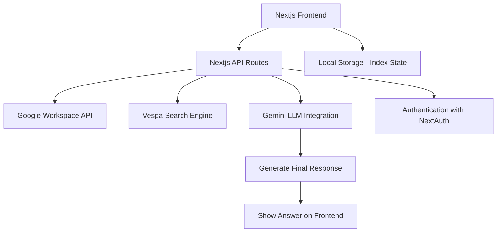

# Architecture Documentation: RAG Challenge - Vespa + TypeScript + Google Workspace Integration

## Overview

This application is a Retrieval-Augmented Generation (RAG) system that integrates with Google Workspace to index and search content from Google Docs, Sheets, and Calendar events. The system provides a chat interface that can answer questions based on the indexed content.

## System Architecture

### High-Level Components

1. **Frontend**: Next.js application with TypeScript
2. **Backend API**: Next.js API routes
3. **Data Sources**: Google Workspace (Docs, Sheets, Calendar)
4. **Search Engine**: Vespa
5. **LLM Integration**: Gemini (for answer generation)

### Architecture Diagram




## Detailed Component Breakdown

### 1. Authentication Flow

- **Technology**: NextAuth.js with Google OAuth 2.0
- **Scopes Requested**:
  - `https://www.googleapis.com/auth/documents.readonly`
  - `https://www.googleapis.com/auth/spreadsheets.readonly`
  - `https://www.googleapis.com/auth/calendar.readonly`
- **Flow**:
  1. User initiates login via Google OAuth
  2. Access token is obtained and stored in session
  3. Token is passed in Authorization header for all API calls

### 2. Google Workspace Integration

#### API Endpoints:

1. **Google Docs**:
   - `GET /api/google/docs` - Lists all Google Docs
   - `GET /api/google/docs/content?id=<docId>` - Gets content of a specific doc

2. **Google Sheets**:
   - `GET /api/google/sheets` - Lists all Google Sheets
   - `GET /api/google/sheets/content?id=<sheetId>` - Gets content of a specific sheet

3. **Google Calendar**:
   - `GET /api/google/calendar` - Lists calendar events
   - `GET /api/google/calendar/content?id=<calendarId>` - Gets formatted calendar content

#### Content Processing:

- **Docs**: Full text extraction
- **Sheets**: Converted to text format (tab-separated values)
- **Calendar**: Events formatted into readable text with details

### 3. Vespa Integration

#### Indexing:

- **Endpoint**: `POST /api/vespa/load`
- **Schema Fields**:
  - `document_id`: Unique identifier
  - `title`: Document title
  - `document_type`: 'doc', 'sheet', or 'calendar'
  - `last_modified`: Timestamp
  - `metadata`: JSON string with additional info
  - `text_summary`: First 500 chars of content
  - `embedding`: Vector embedding (placeholder for future)
  - `content`: Full content

#### Search:

- **Endpoint**: `POST /api/search`
- **Hybrid Search Implementation**:
  - Keyword search across title, summary, and content
  - (Future) Semantic search with vector embeddings
- **Query Construction**:
  ```typescript
  const words = query.trim().split(/\s+/);
  const queryParts = words.map((word) =>
    `(title contains "${word}" OR text_summary contains "${word}" OR content contains "${word}")`
  );
  const combinedQuery = queryParts.join(" OR ");
  ```

### 4. Chat Functionality

#### Flow:

1. User submits query
2. System searches Vespa for relevant documents
3. Top results are concatenated as context
4. Context is sent to Gemini with the original query
5. Response is displayed with source attribution

#### UI Components:

- Message list with alternating user/assistant bubbles
- Source attribution with document type icons
- Loading states and error handling

### 5. Dashboard

#### Features:

- Content overview by type (Docs, Sheets, Calendar)
- Indexing status for each item
- Manual refresh and reindexing capability
- Progress tracking during indexing

#### Implementation:

- Uses tabs for different content types
- Stores indexing state in localStorage
- Shows last modified timestamps
- Visual indicators for indexed status

## Data Flow

### Indexing Process:

1. User clicks "Refresh & Index Content" in dashboard
2. System fetches all Google Workspace content
3. For each new/updated item:
   - Fetches full content
   - Processes content (text extraction/formatting)
   - Indexes in Vespa with metadata
4. Updates local storage with indexed items
5. Shows progress bar during operation

### Search/Chat Process:

1. User submits query in chat interface
2. Frontend sends query to `/api/search` endpoint
3. Backend:
   - Constructs Vespa query
   - Executes search
   - Formats top results as context
   - Calls Gemini with prompt
   - Returns response with sources
4. Frontend displays response with source links

## Key Design Decisions

1. **Hybrid Search Approach**:
   - Currently implements keyword search
   - Architecture ready for vector embeddings (fields defined)
   - Can easily add semantic search later

2. **Content Chunking**:
   - Currently indexes full documents
   - Schema supports chunking (via document_id format)
   - Future: Implement multi-vector indexing with chunk relationships

3. **Authentication**:
   - Uses NextAuth for simplified OAuth flow
   - Tokens are not stored long-term
   - Minimal scope requests

4. **State Management**:
   - Uses localStorage for tracking indexed items
   - Avoids unnecessary re-indexing
   - Provides user feedback on indexing status

5. **Error Handling**:
   - Comprehensive try/catch blocks
   - User-friendly error messages
   - Fallback UI states

## Scalability Considerations

1. **Rate Limiting**:
   - Google API quotas should be monitored
   - Could implement client-side rate limiting

2. **Large Documents**:
   - Current implementation may struggle with very large docs/sheets
   - Future: Implement proper chunking strategy

3. **Vespa Performance**:
   - Schema optimized for text search
   - Ready for vector search expansion

4. **Session Management**:
   - Current implementation relies on NextAuth sessions
   - For production, consider additional session validation

## Future Enhancements

1. **Advanced UI Features**:
   - Document previews
   - Search filters by content type
   - Chat history persistence

2. **Performance Optimization**:
   - Background indexing
   - Incremental updates
   - Caching strategies

## Implementation Notes

The code demonstrates strong TypeScript typing throughout, with well-defined interfaces for API responses and UI components. Error handling is comprehensive, and the architecture follows modern Next.js patterns with API routes for backend functionality.

The Vespa integration shows thoughtful schema design with fields for both keyword search and future vector search capabilities. The hybrid search approach leverages Vespa's strengths while keeping the implementation manageable for the assignment scope.
